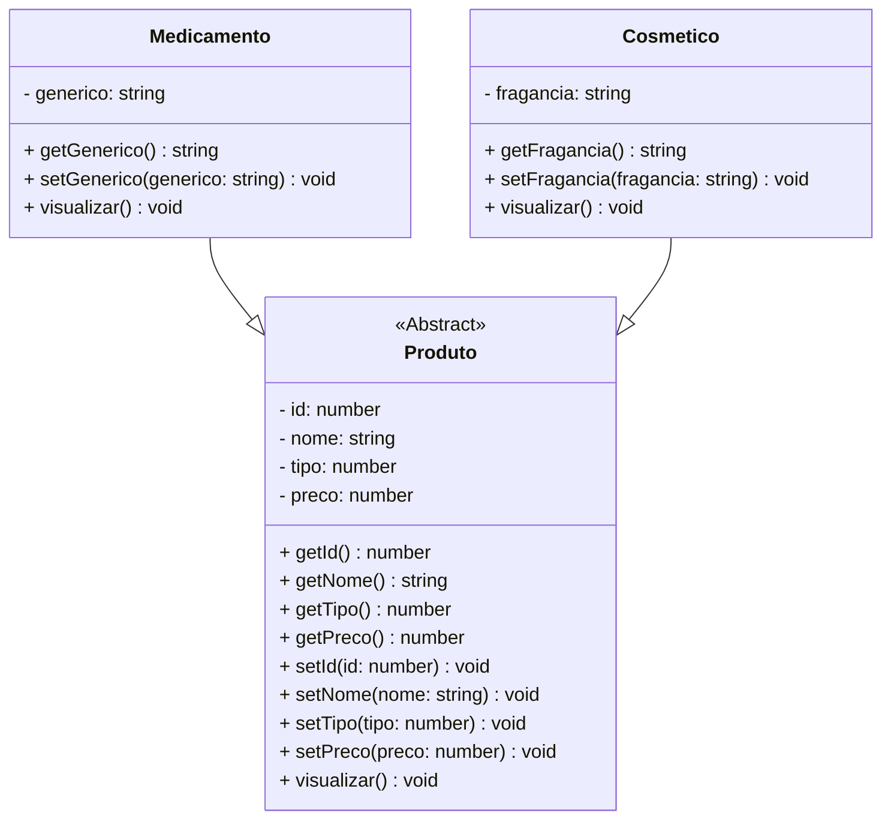

# Projeto CRUD FARMÁCIA - TypeScript & POO

## Simulador de Gerenciamento de Farmácia | Portfólio Profissional

<br />

<div align="center">
	
</div>
<br />

<div align="center">
  
  
  
  
  
  
  
</div>


------

<br />


O **Projeto Farmácia** é um projeto **educacional** desenvolvido em **TypeScript**, com foco em **Programação Orientada a Objetos (POO)** e **arquitetura modular**, simulando o gerenciamento de estoque através de um **CRUD de Medicamentos e Cosméticos**.

**Objetivo:** Demonstrar **organização, domínio técnico, modelagem de domínio e boas práticas de engenharia de software** em um case prático de portfólio.

<br />

> [!WARNING]
>
> Este projeto possui **fins educacionais** e **não representa um sistema farmaceutico real**. Foi desenvolvido para **aprendizado, demonstração técnica e portfólio profissional**.

<br />

Este projeto foi estruturado para:

- Demonstrar **competência técnica em TypeScript**
- Aplicar **POO em um cenário realista** (Herança, Abstração e Polimorfismo)
- Evidenciar **arquitetura limpa e organização de código**
- Simular **regras de negócio de varejo farmacêutico**
- Servir como **case técnico para recrutadores**

<br />

## Competências Técnicas Demonstradas


- Programação Orientada a Objetos (Abstração, Encapsulamento, Herança, Polimorfismo)
- Modelagem de domínio orientada a objetos
- Arquitetura em camadas (**Model, Repository, Controller**)
- Tipagem forte com **TypeScript**
- Uso de **Interfaces** para contratos de repositório
- Separação de responsabilidades e tratamento de dados em Collections (Arrays)
- Validação de entradas e controle de fluxo via CLI

<br />

## Impacto Técnico e Métricas


| Indicador                     | Valor                         |
| ----------------------------- | ----------------------------- |
| Linhas de código              | +500                          |
| Classes principais            | 3 (Produto, Medicamento, Cosmético) |
| Operações CRUD                | 5 (Criar, Listar, Buscar por ID, Atualizar, Deletar) |
| Conceitos POO aplicados       | 6+                            |
| Camadas arquiteturais         | Model, Repository, Controller |
| Persistência                  | Simulada em memória (Array)   |
| Complexidade lógica           | Média                         |
| Uso educacional               | ✅                            |

<br />

## Funcionalidades do Projeto


| Funcionalidade                     | Status |
| ---------------------------------- | ------ |
| Cadastro de Medicamentos e Cosméticos | ✅      |
| Listagem completa de produtos       | ✅      |
| Consulta de produto por ID         | ✅      |
| Atualização de dados de produtos   | ✅      |
| Exclusão de produtos do estoque     | ✅      |
| Diferenciação por Genérico/Fragrância| ✅      |
| Interface CLI interativa (Menu)    | ✅      |

<br />
<br />

### 🧭 Passo a Passo de Uso no Terminal

A navegação interativa pelo terminal ocorre através de seleções numéricas geridas pelo `readline-sync`:

1. **Inicialização do Menu:** Ao executar `Menu.ts`, dois produtos de demonstração (um medicamento e um cosmético) são automaticamente carregados na memória.
2. **Criar Produto (Opção 1):** Digite o nome, preço unitário e selecione a categoria (`1 - Medicamento` ou `2 - Cosmético`).
   * Para medicamentos, informe o princípio ativo/genérico.
   * Para cosméticos, informe a fragrância.
3. **Listar Todos os Produtos (Opção 2):** Exibe a listagem completa com formatação em Real brasileiro (`R$`) via `currencyBr`.
4. **Buscar Produto por Número (Opção 3):** Digite o ID do item para visualizar seus atributos detalhados.
5. **Atualizar Dados (Opção 4):** Informe o ID do produto existente e forneça as novas informações para sobrescrever o registro.
6. **Apagar Produto (Opção 5):** Remove o produto do estoque em memória pelo seu identificador único.
7. **Buscar Produto por Nome (Opção 6):** Realiza uma busca case-insensitive por correspondência textual parcial.
8. **Finalizar (Opção 0):** Encerra a aplicação exibindo os dados de autoria do projeto.

<br />

## Diagrama de Classes




<br />

## Arquitetura do Projeto


Estrutura organizada para facilitar **manutenção, escalabilidade e leitura técnica**:

```text
📦 projeto_farmacia
 ┣ 📂 src
 ┃ ┣ 📂 controller     # Implementação da lógica de negócio (ProdutoController)
 ┃ ┣ 📂 model          # Entidades (Produto, Medicamento, Cosmético)
 ┃ ┣ 📂 repository      # Interface do CRUD (ProdutoRepository)
 ┃ ┗ 📂 util           # Cores e utilitários de formatação
 ┣ 📜 Menu.ts          # Ponto de entrada (Interface com usuário)
 ┗ 📜 tsconfig.json
```

<br />

## Tecnologias Utilizadas


- **Linguagem & Runtime**

  - TypeScript

  - Node.js

  - ts-node/ readline-sync (para entrada de dados)

- **Ferramentas & Qualidade**
  - Git & GitHub
  - Mermaid (diagramas UML)
  - CLI interativa (terminal)

<br />

## Como Executar


**1️⃣ Clone o repositório**

```bash
git clone https://github.com/erickystn/projeto_farmacia.git
```

**2️⃣ Acesse a pasta do projeto via terminal**

```bash
cd projeto_farmacia
```

**3️⃣ Instale as dependências**

```bash
npm install
```

**4️⃣ Execute a aplicação**

```bash
# Execução direta com ts-node global:
ts-node Menu.ts

# Ou via npx (sem necessidade de instalação global):
npx ts-node Menu.ts
```

<br />
<br />

## 💻 Exemplos de Uso e Código

### 1. Polimorfismo e Herança na Criação de Entidades
```typescript
import Medicamento from "./src/model/Medicamento";
import Cosmetico from "./src/model/Cosmetico";
import ProdutoController from "./src/controller/ProdutoController";

const controller = new ProdutoController();

// Instanciando Medicamento (Tipo 1) com atributo especializado
const dipirona = new Medicamento(
    controller.gerarId(),
    "Dipirona Sódica 500mg",
    12.50,
    "Dipirona Monoidratada"
);

// Instanciando Cosmético (Tipo 2) com atributo especializado
const hidratante = new Cosmetico(
    controller.gerarId(),
    "Creme Hidratante Facial",
    45.90,
    "Lavanda e Camomila"
);

controller.criar(dipirona);
controller.criar(hidratante);
```

### 2. Formatação de Saída no Console (`visualizar()`)
```text
********************
  Dados Produto
********************
Código: 1
Nome: Dipirona Sódica 500mg
Categoria: Medicamento
Preço: R$ 12,50
Genérico: Dipirona Monoidratada
```


## Implementações Futuras


- [ ]  Persistência com banco de dados
- [ ]  Testes automatizados (Jest)
- [ ]  API REST com NestJS
- [ ]  Interface Web (React)
- [ ]  Dockerização
- [ ]  CI/CD com GitHub Actions

<br />

## Contribuições


Sugestões, melhorias e pull requests são bem-vindos.

Você pode contribuir com:

- Melhorias arquiteturais
- Refatorações
- Testes automatizados
- Documentação

<br />

## Licença


Este projeto está sob licença **MIT** — livre para uso educacional e profissional.

<br />

##  Autor


**Ericky — Desenvolvedor Full Stack**

🔗 **GitHub:** https://github.com/erickystn

🔗 **LinkedIn:** https://www.linkedin.com/in/erickystn

Projeto desenvolvido para **aprendizado contínuo**, **demonstração técnica** e **portfólio profissional**.